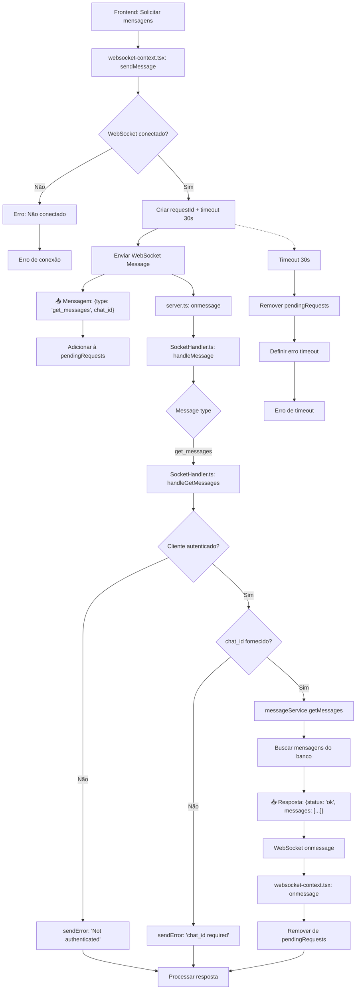

# Fluxograma - Feature: Get Messages



## Descrição do Fluxo de Get Messages

### 📤 **Mensagem Enviada (Frontend → Backend)**

```json
{
  "type": "get_messages",
  "chat_id": "number",
  "requestId": "uuid"
}
```

### 📥 **Resposta (Backend → Frontend)**

```json
{
  "status": "ok" | "error",
  "message": "string",
  "requestId": "uuid",
  "messages": [
    {
      "id": "number",
      "chat_id": "number",
      "user_id": "number",
      "content": "string",
      "created_at": "string",
      "updated_at": "string"
    }
  ] // apenas em sucesso
}
```

### 🔄 **Fluxo WebSocket**

1. **Frontend**: Solicita mensagens enviando `get_messages` com `chat_id`
2. **Backend**: Valida autenticação e `chat_id`, busca mensagens no banco
3. **Resposta**: Retorna array de mensagens ou erro
4. **Timeout**: 30 segundos para resposta

### ❌ **Tratamento de Erros**

- Usuário não autenticado
- chat_id não fornecido
- Timeout de 30 segundos
- Conexão WebSocket perdida
- Erro na consulta ao banco de dados

