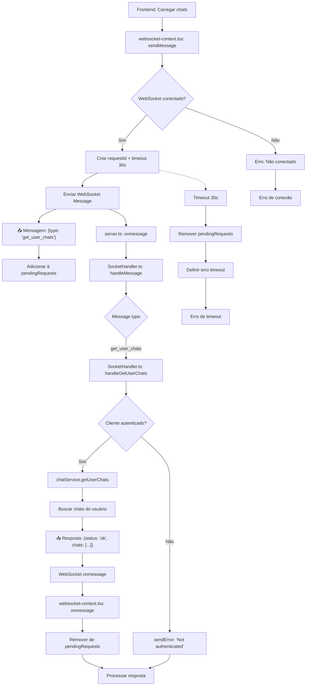

# Fluxograma - Feature: Get User Chats



## Descrição do Fluxo de Get User Chats

### 📤 **Mensagem Enviada (Frontend → Backend)**

```json
{
  "type": "get_user_chats",
  "requestId": "uuid"
}
```

### 📥 **Resposta (Backend → Frontend)**

```json
{
  "status": "ok" | "error",
  "message": "string",
  "requestId": "uuid",
  "chats": [
    {
      "id": "number",
      "name": "string",
      "type": "dm" | "group",
      "created_at": "string",
      "updated_at": "string",
      "last_message": {
        "id": "number",
        "content": "string",
        "created_at": "string",
        "user_id": "number"
      }
    }
  ] // apenas em sucesso
}
```

### 🔄 **Fluxo WebSocket**

1. **Frontend**: Solicita lista de chats enviando `get_user_chats`
2. **Backend**: Valida autenticação e busca todos os chats do usuário
3. **Resposta**: Retorna array com DMs e grupos do usuário
4. **Timeout**: 30 segundos para resposta

### ❌ **Tratamento de Erros**

- Usuário não autenticado
- Timeout de 30 segundos
- Conexão WebSocket perdida
- Erro na consulta ao banco de dados
