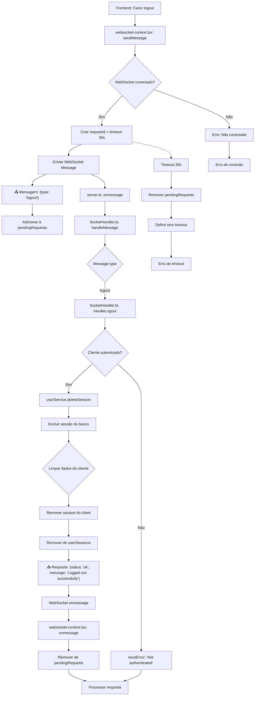

# Fluxograma - Feature: Logout



## Descrição do Fluxo de Logout

### 📤 **Mensagem Enviada (Frontend → Backend)**

```json
{
  "type": "logout",
  "requestId": "uuid"
}
```

### 📥 **Resposta (Backend → Frontend)**

```json
{
  "status": "ok" | "error",
  "message": "string",
  "requestId": "uuid",
  "type": "logout"
}
```

### 🔄 **Fluxo WebSocket**

1. **Frontend**: Solicita logout enviando `logout`
2. **Backend**: Valida autenticação e exclui sessão do banco
3. **Limpeza**: Remove dados de sessão do cliente e mapas internos
4. **Resposta**: Confirma logout bem-sucedido
5. **Timeout**: 30 segundos para resposta

### 🧹 **Limpeza de Sessão**

- Remove sessão do banco de dados
- Limpa `client.session` no servidor
- Remove entrada do `userSessions` map
- Cliente fica desautenticado

### ❌ **Tratamento de Erros**

- Usuário não autenticado
- Timeout de 30 segundos
- Conexão WebSocket perdida
- Erro ao excluir sessão do banco
