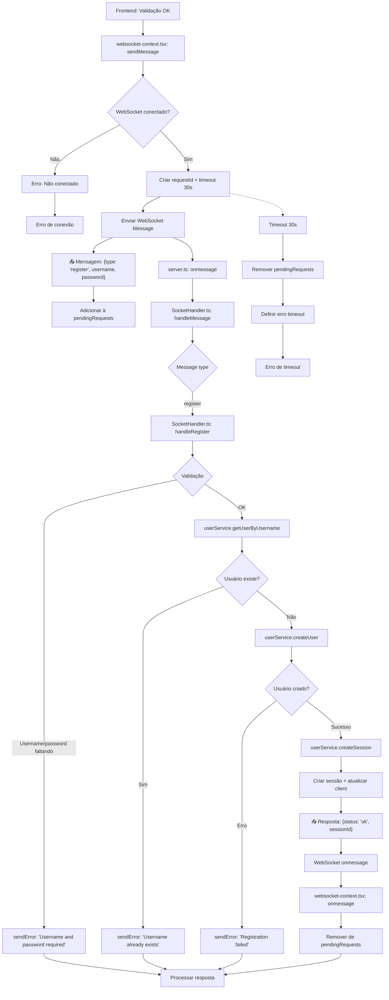

# Fluxograma - Feature: Register



## Descrição do Fluxo de Registro

### 📤 **Mensagem Enviada (Frontend → Backend)**

```json
{
  "type": "register",
  "username": "string",
  "password": "string",
  "requestId": "uuid"
}
```

### 📥 **Resposta (Backend → Frontend)**

```json
{
  "status": "ok" | "error",
  "message": "string",
  "requestId": "uuid",
  "sessionId": "string" // apenas em sucesso
}
```

### 🔄 **Fluxo WebSocket**

1. **Frontend**: Valida dados e envia mensagem `register`
2. **Backend**: Recebe, valida, cria usuário e sessão
3. **Resposta**: Retorna status e dados da sessão
4. **Timeout**: 30 segundos para resposta

### ❌ **Tratamento de Erros**

- Username/password faltando
- Username já existe
- Erro na criação do usuário
- Timeout de 30 segundos
- Conexão WebSocket perdida

