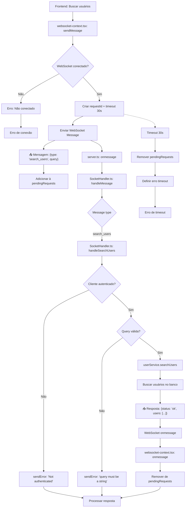

# Fluxograma - Feature: Search Users



## Descrição do Fluxo de Search Users

### 📤 **Mensagem Enviada (Frontend → Backend)**

```json
{
  "type": "search_users",
  "query": "string", // opcional, pode ser vazio para buscar todos
  "requestId": "uuid"
}
```

### 📥 **Resposta (Backend → Frontend)**

```json
{
  "status": "ok" | "error",
  "message": "string",
  "requestId": "uuid",
  "users": [
    {
      "id": "number",
      "username": "string"
    }
  ] // apenas em sucesso
}
```

### 🔄 **Fluxo WebSocket**

1. **Frontend**: Solicita busca de usuários enviando `search_users` com query
2. **Backend**: Valida autenticação e busca usuários no banco
3. **Resposta**: Retorna array de usuários que correspondem à busca
4. **Timeout**: 30 segundos para resposta

### 📝 **Regras de Busca**

- Query vazia: Retorna todos os usuários (exceto o próprio usuário)
- Query com texto: Busca usuários cujo username contenha o texto
- Case-insensitive: A busca não diferencia maiúsculas/minúsculas
- Exclui usuário atual: O próprio usuário não aparece nos resultados

### ❌ **Tratamento de Erros**

- Usuário não autenticado
- Query não é uma string
- Timeout de 30 segundos
- Conexão WebSocket perdida
- Erro na consulta ao banco de dados
