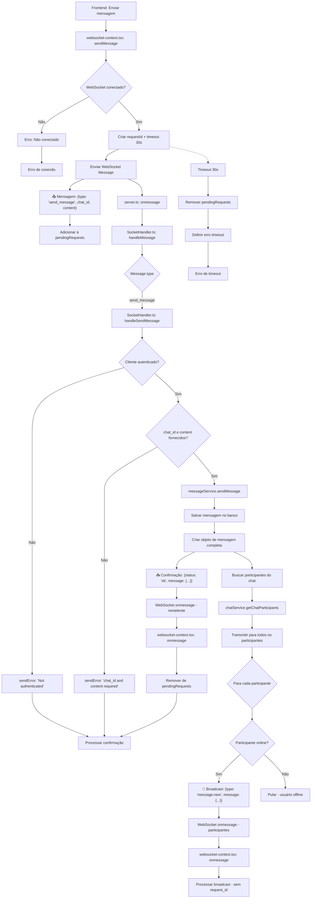

# Fluxograma - Feature: Send Message



## Descrição do Fluxo de Send Message

### 📤 **Mensagem Enviada (Frontend → Backend)**

```json
{
  "type": "send_message",
  "chat_id": "number",
  "content": "string",
  "requestId": "uuid"
}
```

### 📥 **Confirmação (Backend → Remetente)**

```json
{
  "status": "ok" | "error",
  "message": "string",
  "requestId": "uuid",
  "message": {
    "id": "number",
    "chat_id": "number",
    "user_id": "number",
    "content": "string",
    "created_at": "string",
    "updated_at": "string"
  } // apenas em sucesso
}
```

### 📡 **Broadcast (Backend → Participantes)**

```json
{
  "type": "message:new",
  "message": {
    "id": "number",
    "chat_id": "number",
    "user_id": "number",
    "content": "string",
    "created_at": "string",
    "updated_at": "string"
  }
}
```

### 🔄 **Fluxo WebSocket**

1. **Frontend**: Envia mensagem `send_message` com conteúdo
2. **Backend**: Valida, salva no banco e confirma para remetente
3. **Broadcast**: Envia `message:new` para todos os participantes online
4. **Timeout**: 30 segundos para confirmação

### ❌ **Tratamento de Erros**

- Usuário não autenticado
- chat_id ou content não fornecidos
- Timeout de 30 segundos
- Conexão WebSocket perdida
- Erro ao salvar no banco de dados

