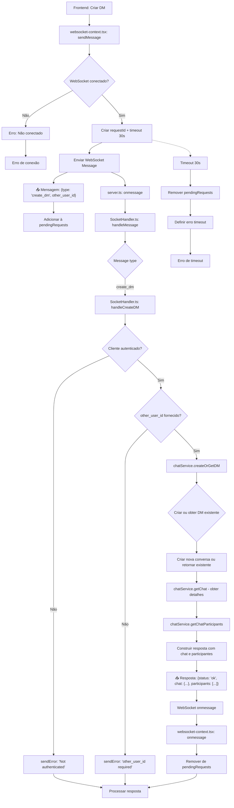

# Fluxograma - Feature: Create DM (Conversa Direta)



## Descrição do Fluxo de Create DM

### 📤 **Mensagem Enviada (Frontend → Backend)**

```json
{
  "type": "create_dm",
  "other_user_id": "number",
  "requestId": "uuid"
}
```

### 📥 **Resposta (Backend → Frontend)**

```json
{
  "status": "ok" | "error",
  "message": "string",
  "requestId": "uuid",
  "chat": {
    "id": "number",
    "name": "string",
    "type": "dm",
    "created_at": "string",
    "updated_at": "string"
  }, // apenas em sucesso
  "participants": [
    {
      "id": "number",
      "username": "string"
    }
  ] // apenas em sucesso
}
```

### 🔄 **Fluxo WebSocket**

1. **Frontend**: Solicita criação de DM enviando `create_dm` com `other_user_id`
2. **Backend**: Valida autenticação, cria ou obtém DM existente
3. **Resposta**: Retorna detalhes do chat e participantes
4. **Timeout**: 30 segundos para resposta

### ❌ **Tratamento de Erros**

- Usuário não autenticado
- other_user_id não fornecido
- Timeout de 30 segundos
- Conexão WebSocket perdida
- Erro na criação/obtenção do chat

