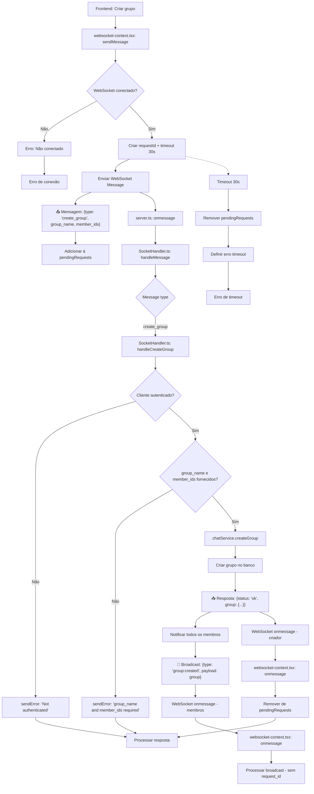

# Fluxograma - Feature: Create Group



## Descrição do Fluxo de Create Group

### 📤 **Mensagem Enviada (Frontend → Backend)**

```json
{
  "type": "create_group",
  "group_name": "string",
  "member_ids": ["number"],
  "requestId": "uuid"
}
```

### 📥 **Resposta (Backend → Criador)**

```json
{
  "status": "ok" | "error",
  "message": "string",
  "requestId": "uuid",
  "group": {
    "id": "number",
    "name": "string",
    "type": "group",
    "created_by": "number",
    "created_at": "string",
    "updated_at": "string"
  } // apenas em sucesso
}
```

### 📡 **Broadcast (Backend → Todos os Membros)**

```json
{
  "type": "group:created",
  "payload": {
    "id": "number",
    "name": "string",
    "type": "group",
    "created_by": "number",
    "created_at": "string",
    "updated_at": "string"
  }
}
```

### 🔄 **Fluxo WebSocket**

1. **Frontend**: Solicita criação de grupo enviando `create_group` com nome e membros
2. **Backend**: Valida autenticação, cria grupo no banco de dados
3. **Resposta**: Retorna detalhes do grupo criado para o criador
4. **Broadcast**: Notifica todos os membros sobre o novo grupo
5. **Timeout**: 30 segundos para resposta

### ❌ **Tratamento de Erros**

- Usuário não autenticado
- group_name ou member_ids não fornecidos
- Timeout de 30 segundos
- Conexão WebSocket perdida
- Erro na criação do grupo
