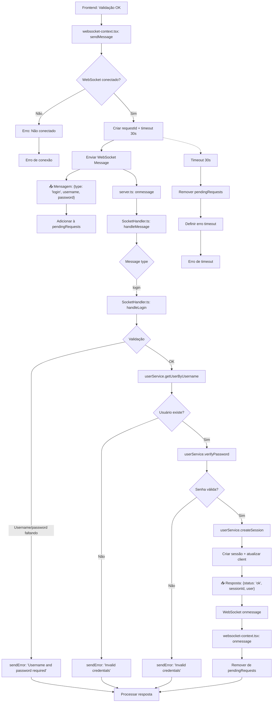

# Fluxograma - Feature: Login



## Descrição do Fluxo de Login

### 📤 **Mensagem Enviada (Frontend → Backend)**

```json
{
  "type": "login",
  "username": "string",
  "password": "string",
  "requestId": "uuid"
}
```

### 📥 **Resposta (Backend → Frontend)**

```json
{
  "status": "ok" | "error",
  "message": "string",
  "requestId": "uuid",
  "sessionId": "string", // apenas em sucesso
  "user": {              // apenas em sucesso
    "id": "number",
    "username": "string"
  }
}
```

### 🔄 **Fluxo WebSocket**

1. **Frontend**: Valida dados e envia mensagem `login`
2. **Backend**: Recebe, valida credenciais e cria sessão
3. **Resposta**: Retorna status, sessão e dados do usuário
4. **Timeout**: 30 segundos para resposta

### ❌ **Tratamento de Erros**

- Username/password faltando
- Credenciais inválidas (usuário não existe ou senha incorreta)
- Timeout de 30 segundos
- Conexão WebSocket perdida

